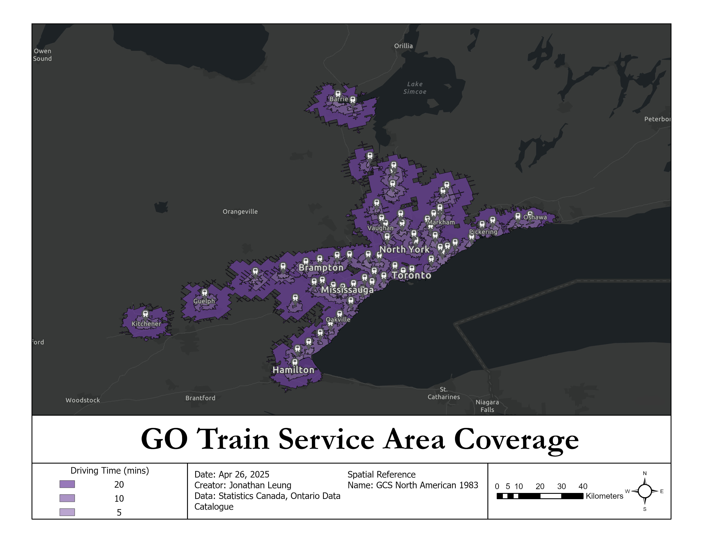
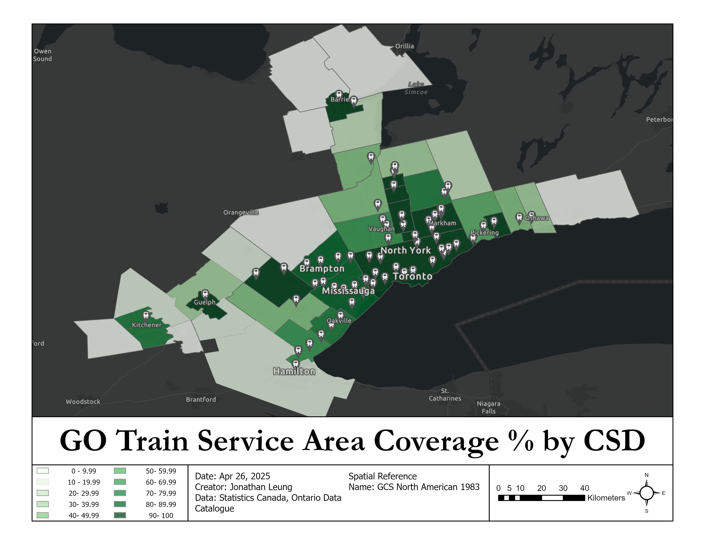

# 🚍 GTA GO Train Coverage Network Analysis

## 📌 Objectives

- Conducted service area analysis on the GO Train railway system to assess its service coverage across the Greater Toronto Area
- Analyzed percentage transit coverage within each GTA Census Subdivision by driving time
- Support transportation planning, such as future stations, with data-driven results
- Identify transit gaps by highlighting municipalities with little coverage within the service area

## 🧰 Tools

- ArcGIS Pro

## ℹ️ Data

- Ministry of Transportation. "GO Train stations"[csv].Scale Not Given. "Ontario Data Catalogue". April 25, 2024. [https://data.ontario.ca/dataset/go-train-stations](https://data.ontario.ca/dataset/go-train-stations)
- Statistics Canada. "2016 Census Program - Age and Sex Highlight Tables"[shp,csv]. 

## 📊 Workflow

### A. 🛜 Service Area Analysis
- Import the GO Train Station point layer as facilities into the Service Area Analysis tool
- Generate Service Area polygons on 5, 10, and 20-minute driving time

### B. 🔧 Configuring Census Subdivision Layer
- Run **Select By Location** CSDs in the CSD shapefile that intersect with the service area layer
- Join Census Data with CSD shapefiles using **Spatial Join**
  -  Use **field calculator** to calculate the total area of each CSD polygon

### C. 💡 Creating an overlapped feature class
- Run **Intersect** with the CSD layer and the service area layer to produce a new feature class of polygons containing overlapping areas
  - Calculate the total area of each polygon with **field calculator**
  - Calculate the sum of polygons that share the same CSDUID

### D. 🧮 Computing the transit coverage% of each CSD
- Join the overlapped feature class to the original CSD shapefile using CSDUID (identifier)
- Calculate % of each CSD's area covered by the service area

## 🗺️ Output

## ✍️ Author

Jonathan Leung — University of Waterloo, Geomatics with Co-op

