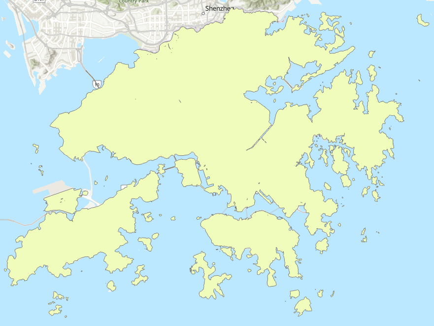

# 🛠️ Workflow

This document outlines the step-by-step workflow used to project the extent of coastal flooding in Hong Kong in 2100.

## Workflow Steps

### A. Data Preparation
- Download **Land Utilization Raster Grid**, and **Hong Kong Digital Terrain Model** from [DATA.GOV.HK](https://data.gov.hk/en/)
- Restyle classification symbology for **Land Utilization Raster Grid** layer
- DTM dataset does not contain any coordinates
  - Manual Georeferencing is required

### B. Topographic Map
Run *Contour (Spatial Analyst)* to convert DTM layer into a topographic map 
- As a Python Script:
  <pre><code>import arcpy

  # Setting workspace
  arcpy.env.workspace = r"C:\Users\User\Documents\JonathanLeung_Winter2025\HK_DTM_5m_Full"
  arcpy.env.overwriteOutput = True

  # Contour Tool
  HK_DTM = "Whole_HK_DTM_5m.asc"
  outContour = r"C:\Users\User\Documents\JonathanLeung_Winter2025\HK_DTM_5m_Full\HK Processing\HK Processing.gdb\Contour_Whole_HKDTM"
  arcpy.sa.Contour(HK_DTM,outContour,contour_interval=30,base_contour=0, z_factor=1,contour_type='CONTOUR') </code></pre>

### C. Digital Elevation Model 
- Set boundary for *Topo to Raster (Spatial Analyst)*
  - Generate a feature class of polygons covering the entire Hong Kong territory

- Run *Topo to Raster (Spatial Analyst)* to convert the topographic map to a DEM

### D. Flood Level Simulation 
- Run *Raster Calculator (Spatial Analyst)* to generate binary raster layers that indicate areas that would be submerged under water or not
  This project uses these [figures](https://www.hko.gov.hk/en/climate_change/proj_hk_msl_med_conf_info.htm) for analysis 
Inputs

Emission Scenario  | Median (m)  | Algebra Expression
------------- | ------------- | -------------
Very low  | 0.38 | "HKDEM"<=0.38
Intermediate | 0.56 | "HKDEM"<=0.56
Very High | 0.78 | "HKDEM"<=0.78

> Red indicates flooded areas
> Grey indicates non-flooded areas
- Delete the grey label in the symbology tab for better visualization

### E. Symbology
- ***Main Map***
  - Apply OpenStreetMap Dark Gray Canvas Base (WGS84) as basemap
  - Overlay flood binary raster layers on top of each other
  - Style all binary raster layers in different shades of blue or cyan

- ***Inset Maps***: highlight 3 specific areas to showcase impact
  - Overlay the intermediate emission scenario flood binary raster layer on **Land Utilization Raster Grid**
  - Apply transparency and layer blend to show what land use would be affected by coastal flooding

---

### Final Product

